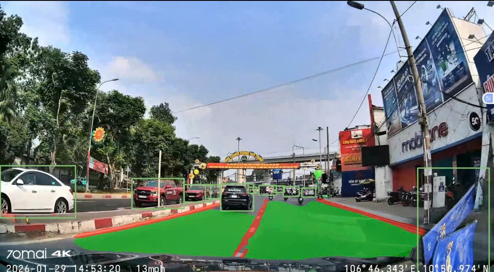

# YOLOP - Autonomous Driving Perception (Thesis)

Huấn luyện mô hình YOLOP cho bài toán nhận thức cảnh quan lái xe tự động.  
Nhóm 8 — Khoa Vật Lý, ĐHKHTN — ĐHQGHN, 2026.

## Kết quả (BDD100K val, 10,000 ảnh)

| Chỉ số | Paper gốc | Pretrained (test lại) | Mô hình của nhóm |
|--------|:---------:|:---------------------:|:----------------:|
| DA mIoU | 91.5% | 89.2% | **89.8%** |
| LL IoU | 70.5% | 38.4% | **45.7%** |
| Recall | 89.2% | 89.2% | 87.8% |
| mAP@0.5 | 76.5% | 76.5% | **76.1%** |

## Training Curves
.png)

## Chiến lược huấn luyện
- **Giai đoạn 1:** Epoch 1–89, BDD100K (70k ảnh), train from scratch
- **Giai đoạn 2:** Epoch 90–118, BDD45K (35k ảnh), resume từ epoch 89
- Fix NMS tại epoch 89: conf threshold 0.001 → 0.3
- GPU: Kaggle Tesla T4 × 2, Batch size: 24, Optimizer: Adam LR=0.001

## Dataset
Sử dụng BDD100K dataset (tập con BDD45K - 45,000 ảnh).  
Download tại: [Kaggle BDD45K]([https://www.kaggle.com/datasets/eoiwgjlm/bdd45k](https://www.kaggle.com/datasets/eoiwgjlm/bdd45k))

Cấu trúc thư mục:
```
yolop_subset/
├── images/
│   ├── train/
│   └── val/
├── det_annotations/
│   ├── train/
│   └── val/
├── da_seg_annotations/
│   ├── train/
│   └── val/
└── ll_seg_annotations/
    ├── train/
    └── val/
```
## Demo

Clone repo gốc YOLOP:
```bash
git clone https://github.com/hustvl/YOLOP.git
cd YOLOP
pip install -r requirements.txt
```

Download weights: [epoch-117.pth](https://drive.google.com/file/d/1aO5aUmC3QLAJLxpdT0W-6r8oAEDaFTmc/view?usp=sharing)
Đặt file `.pth` vào thư mục `weights/`.
Download video/ảnh muốn test đặt vào 'inference/videos/'
Chạy inference trên video:
```bash
python tools/demo.py --source inference/videos/your_video.mp4 --save-dir inference/output 
```
## Kết quả Demo
*Test trên video thực tế tại Việt Nam*


## Thành viên nhóm
| Họ tên | MSSV |
|--------|------|
| Nguyễn Thị Thu Hà | 23001603 |
| Triệu Quốc Khánh | 23001615 |
| Lê Văn Đạt | 23001592 |
| Triệu Đình Dũng | 23001587 |

## Tài liệu tham khảo
- [YOLOP paper](https://arxiv.org/abs/2108.11250)
- [BDD100K dataset](https://bdd-data.berkeley.edu/)
